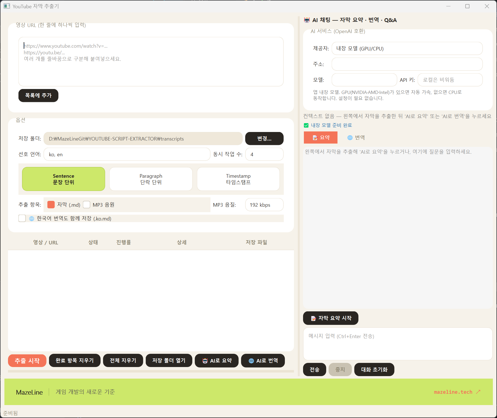

# YouTube 자막 추출기 (YouTube Transcript Extractor)

YouTube 영상 링크를 입력하면 자막(transcript)을 추출해 **마크다운(.md)** 파일로 저장하고, 선택적으로 **MP3 음원**과 **MP4 영상**도 내려받는 데스크톱 프로그램입니다. Qt 6(PySide6) 기반 GUI이며, **여러 영상을 동시에** 추출할 수 있습니다.



## 주요 기능

- **다중 URL 입력** — 여러 줄로 붙여넣어 한 번에 목록에 추가
- **동시 추출** — `QThreadPool` 기반 병렬 처리 (동시 작업 수 1~16 조절)
- **자막 → 마크다운** — 제목·URL·채널·언어·추출 시각 메타데이터 + 본문
- **포맷 선택** — 문장 단위 / 단락 단위 / 타임스탬프 포함 3가지 형식
- **MP3 음원 추출** — yt-dlp + 동봉 ffmpeg로 음원만 추출 (128 / 192 / 320 kbps)
- **MP4 영상 다운로드** — 화질 선택(1080p / 720p / 원본), H.264 우선으로 어느 플레이어에서나 재생 (재인코딩 없이 mp4 컨테이너로 remux)
- **언어 우선순위** — 예: `ko, en, ja` 순으로 자막 탐색, 수동 자막 우선/번역 폴백
- **실시간 진행 표시** — 각 작업의 상태/진행/저장 파일을 표로 확인, 더블클릭으로 파일 열기
- **스플래시 화면** — 앱 시작 시 3초간 로딩 화면 표시
- **자동 업데이트 확인** — 시작 시 백그라운드로 최신 버전 확인

## AI 채팅

우측 **AI 채팅** 패널로 추출한 자막을 요약·번역·질문할 수 있습니다.

- **요약 탭** — 자막 핵심 내용을 한국어로 요약
- **번역 탭** — 자막 전체를 한국어로 번역, 완료 시 자동으로 `.ko.md` 파일로 저장 (체크박스 옵션)
- **기본 제공자** — 앱 내장 모델(**Gemma 4 E4B**, Apache-2.0), 첫 사용 시 Hugging Face에서 자동 다운로드(약 5.3GB), 이후 오프라인 동작
- **GPU 가속** — NVIDIA·AMD·Intel GPU 감지 시 Vulkan으로 자동 가속 (CPU 대비 ~10~20배), 없으면 CPU 동작
- **외부 API 연결** — OpenAI / Ollama / 로컬 서버 주소 직접 입력 가능

### llama-cpp-python 설치 (내장 모델 사용 시)

> **AVX512 주의**: 사전빌드 휠은 AVX512로 컴파일돼 있어 대부분의 컨슈머 CPU에서 죽습니다. 반드시 **AVX2 소스 빌드**하세요.

```bash
# Windows (MSVC + CMake/Ninja 필요)
set CMAKE_ARGS=-DGGML_NATIVE=OFF -DGGML_AVX2=ON -DGGML_FMA=ON -DGGML_F16C=ON -DGGML_AVX512=OFF -DCMAKE_C_FLAGS=/utf-8 -DCMAKE_CXX_FLAGS=/utf-8
pip install "llama-cpp-python>=0.3.0" --no-binary llama-cpp-python --no-cache-dir
```

## 설치 및 실행

```bash
pip install -r requirements.txt
python run.py
```

Python 3.10 이상 필요.

## 릴리스 빌드 (Windows 실행파일)

PyInstaller로 폴더 형태 빌드를 만든 뒤 ZIP으로 배포합니다.

```bash
pip install pyinstaller
pyinstaller --noconfirm --clean YouTubeTranscriptExtractor.spec
# 결과: dist/YouTubeTranscriptExtractor/ 폴더
```

빌드 검증:
```bash
dist\YouTubeTranscriptExtractor\YouTubeTranscriptExtractor.exe --selftest
```

## 배포 (FTP)

`ftp-config.example.json`을 복사해 `ftp-config.json`을 만들고 비밀번호를 채운 뒤:

```bash
python scripts/deploy.py            # 빌드 zip + 매니페스트 + 업로드
python scripts/deploy.py --check    # FTP 연결 테스트만
python scripts/deploy.py --dry-run  # 업로드 없이 목록 확인
```

업로드 대상: `mazeline.tech/updates/youtubeTranscriptExtractor/`

## 사용법

1. 상단 입력란에 YouTube URL을 한 줄에 하나씩 붙여넣고 **목록에 추가**를 누릅니다.
2. **옵션**에서 저장 폴더, 선호 언어, 동시 작업 수를 설정합니다.
3. **포맷 카드**에서 문장 단위 / 단락 단위 / 타임스탬프 중 하나를 선택합니다.
4. **추출 항목**에서 `자막 (.md)` / `MP3 음원` / `MP4 영상`을 선택합니다(여러 개 동시 가능). `MP4 영상` 선택 시 화질(1080p / 720p / 원본)을 고를 수 있습니다.
5. **한국어 번역도 함께 저장** 체크 시, AI 번역 완료 후 `.ko.md` 파일이 자동 저장됩니다.
6. **추출 시작**을 누르면 병렬 처리가 시작됩니다.
7. 표의 항목을 더블클릭하면 저장된 파일이 열립니다.
8. 추출 완료 후 우측 패널에서 **AI로 요약** 또는 **AI로 번역**을 눌러 AI 기능을 사용합니다.

> **ffmpeg 안내**: MP3 변환과 MP4 영상 병합·remux에는 ffmpeg가 필요합니다. `imageio-ffmpeg`가 ffmpeg 바이너리를 함께 제공하므로 별도 설치 없이 동작합니다.

기본 저장 위치는 실행 폴더의 `transcripts/` 입니다.

## 출력 예시

```markdown
# 영상 제목

- **URL**: https://www.youtube.com/watch?v=VIDEO_ID
- **영상 ID**: VIDEO_ID
- **채널**: 채널명
- **자막 언어**: Korean (`ko`, 수동 작성)
- **추출 시각**: 2026-05-25 14:30:00

---

## Transcript

안녕하세요, 오늘은 유니티에서 캐릭터를 추가하는 방법에 대해 알아보겠습니다.
```

## 프로젝트 구조

```
YOUTUBE-SCRIPT-EXTRACTOR/
├── run.py                        # 실행 진입점
├── requirements.txt
├── YouTubeTranscriptExtractor.spec   # PyInstaller 빌드 스펙
├── scripts/
│   └── deploy.py                 # 빌드 ZIP 패킹 + FTP 배포
├── ftp-config.example.json       # FTP 설정 템플릿
└── yt_extractor/
    ├── __init__.py               # 버전 정보
    ├── app.py                    # PySide6 (Qt 6) GUI 메인
    ├── core.py                   # 추출 로직 (URL 파싱·자막·MP3·MP4·마크다운)
    ├── chat_render.py            # AI 채팅 HTML 렌더러
    ├── local_llm.py              # 내장 llama-cpp-python LLM 래퍼
    ├── splash.py                 # 스플래시 화면
    ├── updater.py                # 업데이트 확인 (백그라운드 QThread)
    └── img/
        └── mazelinebanner.jpg
```

`core.py`는 GUI에 의존하지 않으므로 CLI 등 다른 프론트엔드에서도 재사용할 수 있습니다.

## 구현 가이드 (개발자용)

### MP4 영상 추출

`extract_video()` 함수는 yt-dlp를 사용해 YouTube 영상을 MP4로 다운로드합니다.

```python
from yt_extractor.core import extract_video

# 1080p 영상 다운로드 (H.264 우선)
mp4_path = extract_video(url, output_dir, height=1080)
```

**구현 세부사항:**

1. **포맷 선택 로직** (`core.py:847-851`):
   - H.264(`vcodec^=avc1`) 우선 → 호환성 최우선
   - AV1/VP9는 일부 플레이어에서 재생 불가 (예: Windows 기본 플레이어)
   - 원본 화질 요청 시 `height=0` 전달

2. **재인코딩 없는 remux** (`core.py:856`):
   - `FFmpegVideoRemuxer`로 컨테이너만 MP4로 변경
   - 화질 손실 없이 빠른 처리 (seconds 단위)

3. **병렬 다운로드** — yt-dlp 내장 fragment 병렬 다운로더(`concurrent_fragment_downloads`)를 사용합니다.

   > **다운로드 실패 원인(해결됨):** 과거에는 aria2c를 외부 다운로더로 사용했으나, YouTube + Windows 환경에서 aria2c가 `WSAENETUNREACH`(unreachable network) 에러로 종료(exit 1)되어 **MP3·MP4 다운로드가 모두 실패**했습니다. aria2c 경로를 제거하고 네이티브 다운로더로 통일해 해결했습니다. (`_download_accel_opts()` 참고)

4. **취소 지원**:
   - `should_cancel` 콜백으로 진행 중인 작업 중단 가능
   - yt-dlp hook 내부에서 `_Cancelled` 예외 발생

### MP3 음원 추출

`extract_audio_mp3()`는 동일한 `_download()` 파이프라인을 사용합니다.

```python
from yt_extractor.core import extract_audio_mp3

# 192kbps MP3 추출
mp3_path = extract_audio_mp3(url, output_dir, bitrate="192")
```

포맷: `bestaudio/best` → `FFmpegExtractAudio` postprocessor.

### 확장: 새로운 포맷 추가

`_download()`는 일반적인 다운로드 파이프라인입니다. 예를 들어 WEBM 추출:

```python
def extract_webm(url, out_dir, **kwargs):
    return _download(
        url, out_dir,
        fmt="bestvideo+bestaudio",
        postprocessors=[{"key": "FFmpegVideoRemuxer", "preferedformat": "webm"}],
        out_ext="webm",
        merge_output_format="webm",
        **kwargs
    )
```

## 참고

- 자막은 YouTube가 제공하는 경우에만 추출됩니다. 자막이 비활성화된 영상은 추출할 수 없습니다.
- 짧은 시간에 많은 요청을 보내면 YouTube가 일시적으로 IP를 제한할 수 있습니다. 이 경우 동시 작업 수를 줄이세요.
- 내장 AI 모델(Gemma 4 E4B)은 처음 실행 시 약 5.3GB를 다운로드합니다. 이후에는 오프라인으로 동작합니다.

---

[MazeLine](https://mazeline.tech/) — 게임 개발의 새로운 기준
